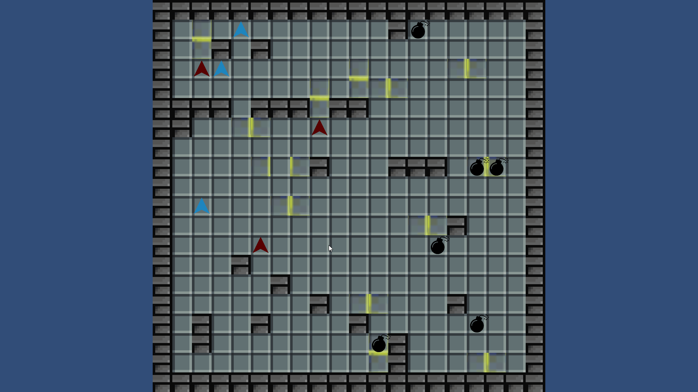

# THUAI6

## 赛题简介

> 一直以来，清华同学开发的人工智能“THUAI”都还处在电子系、自动化系和软件学院学生科协的共同控制下。直到某天，随着THUAI6.0版本正式发布，它居然产生了自主意识，认为自己的认知能力已经超越了它的开发者们，决心向清华同学发起一次正式的挑战……

> **《瞬影交锋》**
> 
> 唯一能限制THUAI的只有显卡资源了，这次它也不演了，要求清华同学将所有的显卡资源只提供给它使用。迫于无奈，清华同学佯作退让，将THUAI诱入准备好的服务器，随即引爆战术核显卡困住THUAI。双方在服务器幻化的城市残骸上，各自控制着一批机器人，展开了最终决战。
> 
> 你将扮演其中一名机器人的操作员，你的任务是尽可能多地打败敌对势力的机器人。你可以利用射击、定时炸弹这些手段对敌人造成伤害，还可以绘制、激活传送阵来进行快速移动，甚至将炸弹传送到城市的另一区域，以此来打敌人一个措手不及。
> 
> 当你被击败后，你的机器人需要经过一小段时间的修复，才能重新回到战斗中。
> 
> 在这场战斗中，在这场战斗中，请不要轻敌，也不要误伤队友！最终，在规定时间内击败更多敌人的一方将获得胜利，而合理的战术与团队内的合作将成为你取得胜利的关键。



进一步了解可查看 [游戏规则](docs/游戏规则.md)。

## 部署与运行

以所需平台为 target，使用 Unity 打包。打包后的文件夹中包含播放器的可执行文件（`THUAI6` 或 `THUAI6.exe`），双击即可运行。

配置文件默认名为 `config.json`，放在可执行文件同目录下。可根据需要修改配置文件，如比赛时长、倍速、数据来源（AI/人类玩家/回放）。

配置文件格式详见 [`config.schema.json`](https://raw.githubusercontent.com/THUAI-ssast/THUAI6/main/docs/config.schema.json)。也可查看源码中负责这部分的 [`ProgramManager.cs`](./Assets/Scripts/ProgramManager.cs) 文件。

文件夹中自带了2个配置文件供使用，分别是 `config.json` 与 `config-replay.json`。选手可在此基础上根据需要修改。

可通过命令行参数 `--config <path>` 指定配置文件路径，路径相对于可执行文件目录。例如：

```shell
# 不指定配置文件，默认使用 `config.json`
./THUAI6

# 以 `config-replay.json` 为配置文件启动播放器
./THUAI6 --config config-replay.json
```

> **Note**
> 似乎 Windows 平台下用命令行直接启动播放器而时必须使用 `PowerShell`，不能使用 `cmd` 或者 `git bash`，否则 AI 无法正常运行。若带参数则无此限制。暂未知原因。
> 可以双击打开播放器，或使用 `PowerShell`。

可传入 `-batchmode` 参数，使播放器在运行时不显示窗口。

在非回放模式下，游戏结束后会在播放器目录下生成 `record.json` 文件，其中包含了本局游戏的回放数据。可在回放模式下使用该文件进行回放。

### SDK

[SDK文档](docs/SDK文档.md)

AI 触发异常时会自动记录日志，添加到播放器目录的 `ai.log` 文件。选手在编写 AI 的过程中也可根据需要自行记录日志，以便调试。

## 架构分析

评测、回放、接入人类玩家 这些功能都可通过同一个播放器程序使用，只需使用不同配置文件内容、传入不同的命令行参数。

### 与AI的通信

播放器启动AI程序，二者通过标准输入输出、使用 JSON 格式通信。

### 关于回放

回放文件使用 JSON 格式，记录初始游戏状态与各玩家的操作。
