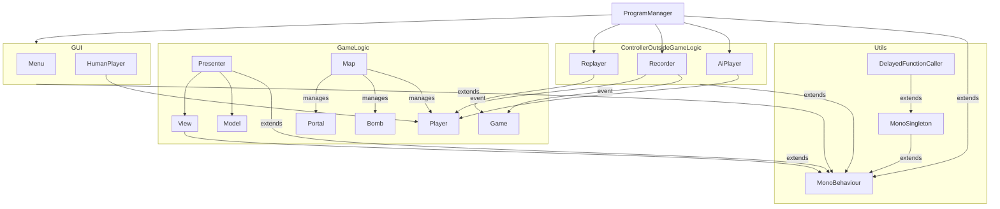

# 开发文档

## 整体结构

### Scripts 关系图

Model: 不继承MonoBehaviour，维护数据，可供外部代码使用。处理状态被动改变的操作（如炸弹爆炸，玩家受伤是被动的）。

Presenter: 继承MonoBehaviour，处理游戏逻辑，包括依赖Unity引擎的。可使用FixedUpdate，不使用Update。处理状态主动改变的操作。

View: 继承MonoBehaviour，处理不影响游戏逻辑的部分。可使用Update，不使用FixedUpdate。

当前在GameLogic上的架构其实还是有问题，比如 为什么有的放Model有的放Presenter其实并不非常清晰、Model对Presenter与外部代码的开放程度本应不同但却实际上相同，但顾不上了。更好的架构也许可能是不要管什么MVC、MVP，把MP合并再分成平台适配层与业务层两部分，然后形成表现层、业务层、平台适配层垂直三层？不过只好等以后再说吧，还需要更多学习与实践。

## 文件格式

回放文件记录地图、游戏过程与最终结果。
